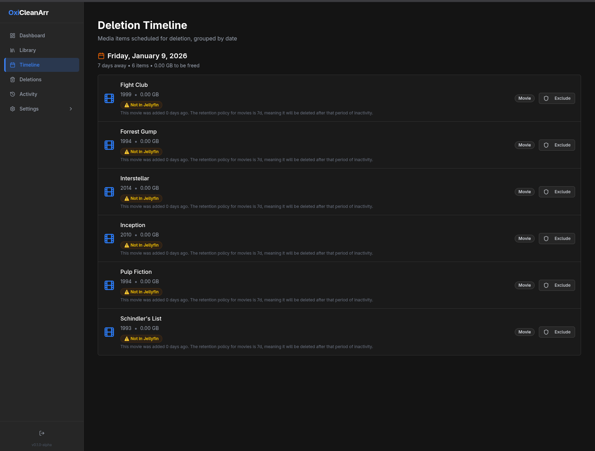
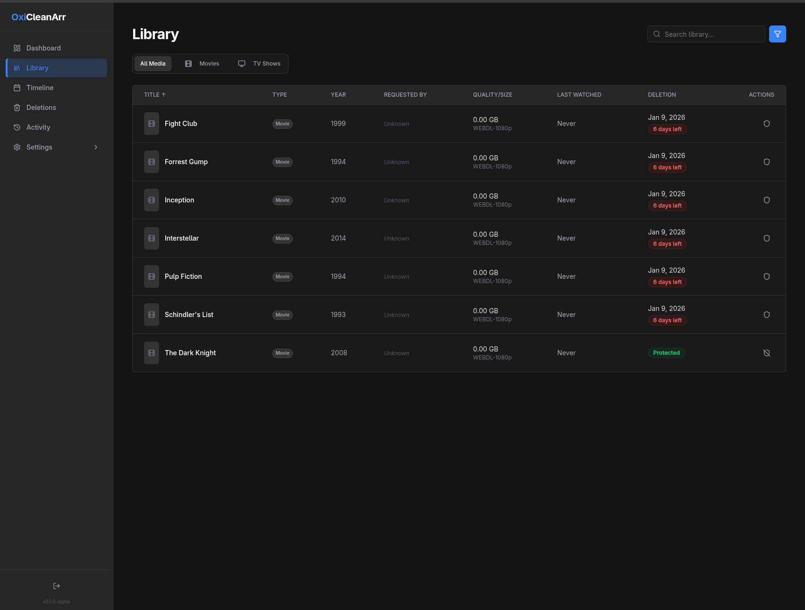
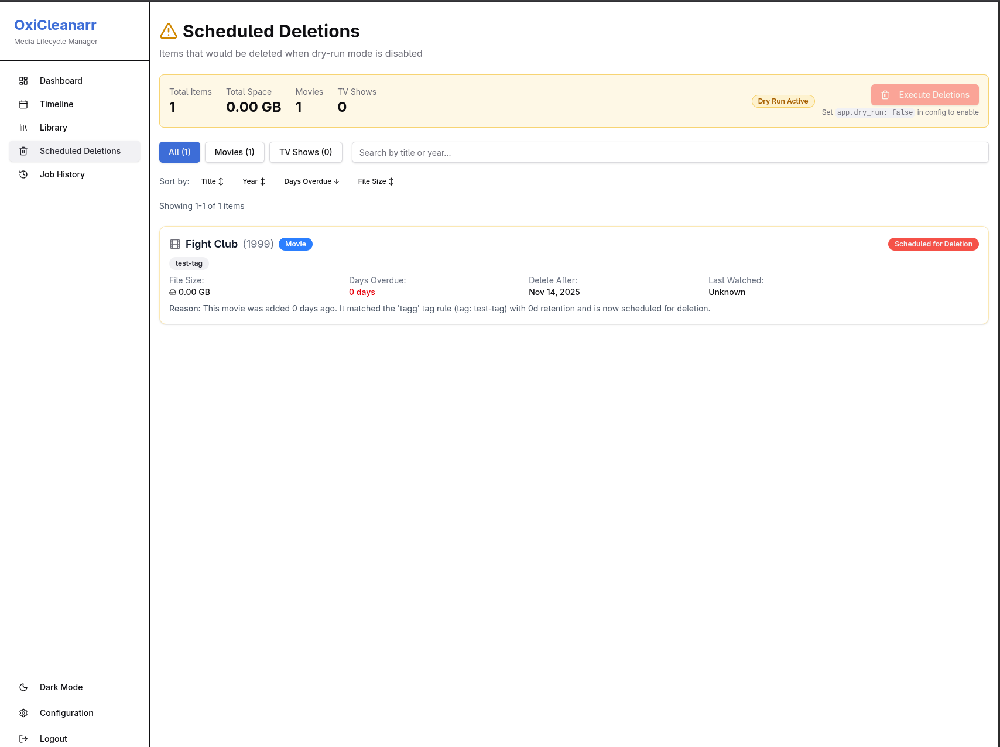
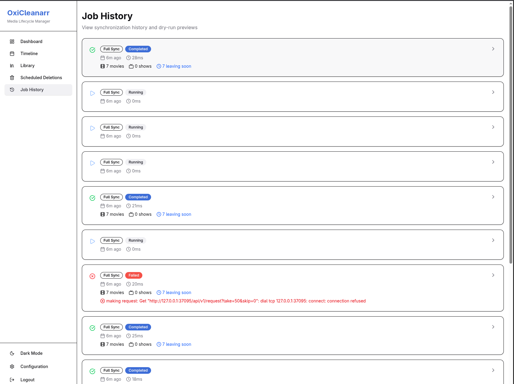
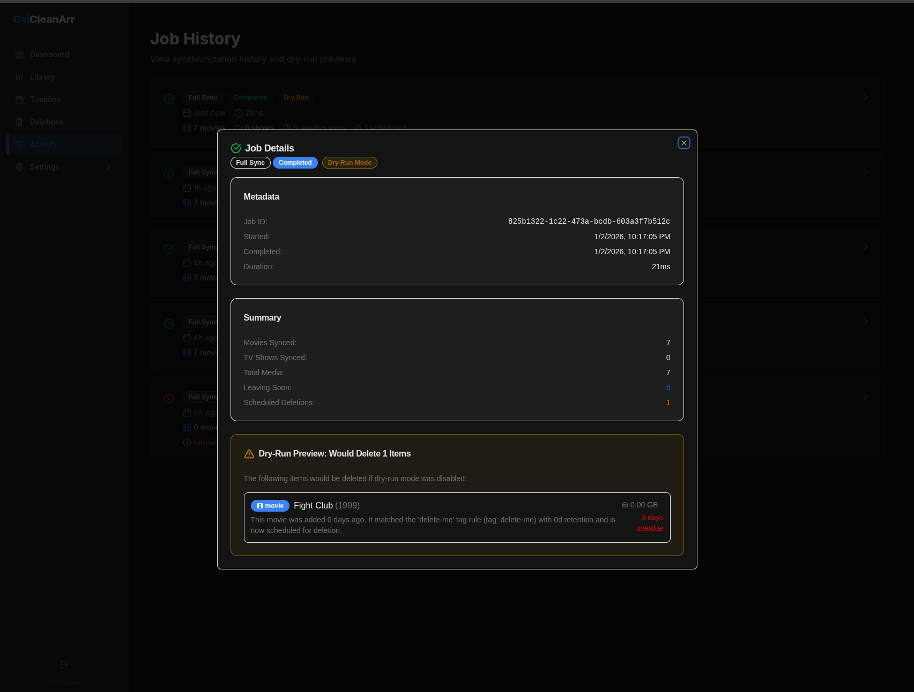

# OxiCleanarr

> **"But wait, there's more!"** - A lightweight media cleanup automation tool for the *arr stack with Jellyfin integration.

**OxiCleanarr** removes media clutter from your Jellyfin server with the power and effectiveness you'd expect from a product endorsed by Billy Mays himself! Just like OxiClean tackles tough stains, OxiCleanarr tackles your unwatched media backlog.

> **Built with AI:** This project was created ~90% with AI assistance using [OpenCode](https://opencode.ai/) and Claude 3.5 Sonnet.

## Features

- **Automated Media Cleanup**: Intelligently removes unwatched media based on configurable retention rules
- **Advanced Rules Engine**: Tag-based, user-based, and watched-based cleanup rules for fine-grained control
- **"Leaving Soon" Library**: Creates symlink libraries in Jellyfin to preview content scheduled for deletion
- **Multi-Service Integration**: Supports Jellyfin, Radarr, Sonarr, Jellyseerr, and Jellystat
- **Safe Operations**: Dry-run mode enabled by default, manual exclusions, and job history tracking
- **Hot Configuration Reload**: Update settings without restarting the application
- **RESTful API**: Complete HTTP API with JWT authentication
- **Structured Logging**: JSON-formatted logs for easy parsing and monitoring

## Screenshots

<details>
<summary>Click to view screenshots</summary>

### Dashboard

*Overview of your media cleanup status with key metrics and recent activity*

### Timeline View

*Visual timeline showing when media items are scheduled for deletion*

### Library Management

*Browse and manage your entire media library with filtering and sorting*

### Scheduled Deletions

*Review items scheduled for deletion and manage exclusions*

### Job History

*Track all sync operations and cleanup jobs with detailed history*

### Job Details

*Detailed view of job execution with statistics and timing information*

</details>

## Quick Start

### Prerequisites

- Docker (recommended) or Go 1.21+ (for building from source)
- Active *arr stack services (Radarr and/or Sonarr)
- Jellyfin instance
- **[OxiCleanarr Bridge Plugin](https://github.com/ramonskie/jellyfin-plugin-oxicleanarr)** installed in Jellyfin

> **⚠️ IMPORTANT:** The OxiCleanarr Bridge Plugin is **required** for Jellyfin integration. It provides file system operations (symlink management, directory operations) that Jellyfin's native API doesn't support. Without this plugin, OxiCleanarr cannot create "leaving soon" libraries or manage media lifecycle.

### Installation

#### Option A: Docker (Recommended)

**Pull the latest image:**

```bash
docker pull ghcr.io/ramonskie/oxicleanarr:latest
```

**Run with Docker:**

```bash
docker run -d \
  --name oxicleanarr \
  -p 8080:8080 \
  -v /path/to/config:/app/config \
  -v /path/to/data:/app/data \
  -v /path/to/media:/data/media:ro \
  -e PUID=1000 \
  -e PGID=1000 \
  -e TZ=UTC \
  ghcr.io/ramonskie/oxicleanarr:latest
```

**Or use Docker Compose** (see [NAS_DEPLOYMENT.md](NAS_DEPLOYMENT.md) for detailed examples)

**Available Tags:**
- `ghcr.io/ramonskie/oxicleanarr:latest` - Latest stable release
- `ghcr.io/ramonskie/oxicleanarr:v1.0.0` - Specific version
- `ghcr.io/ramonskie/oxicleanarr:1.0` - Major.minor version
- `ghcr.io/ramonskie/oxicleanarr:1` - Major version

#### Option B: Build from Source

#### Step 1: Install the OxiCleanarr Bridge Plugin

1. Open Jellyfin → **Dashboard** → **Plugins** → **Repositories**
2. Click **"+"** to add a repository
3. Enter:
   - **Repository Name**: `OxiCleanarr Plugin Repository`
   - **Repository URL**: `https://cdn.jsdelivr.net/gh/ramonskie/jellyfin-plugin-oxicleanarr@main/manifest.json`
4. Click **Save**
5. Go to **Dashboard** → **Plugins** → **Catalog**
6. Find "OxiCleanarr Bridge" and click **Install**
7. Restart Jellyfin when prompted
8. Verify the plugin is loaded: **Dashboard → Plugins → OxiCleanarr Bridge**

> **Manual Installation**: For manual installation from source or releases, see the [plugin repository](https://github.com/ramonskie/jellyfin-plugin-oxicleanarr)

#### Step 2: Build OxiCleanarr

1. Clone the repository:
```bash
git clone https://github.com/ramonskie/oxicleanarr.git
cd oxicleanarr
```

2. Build the application:
```bash
go build -o oxicleanarr cmd/oxicleanarr/main.go
```

3. Create configuration file:
```bash
mkdir -p config
cp config/config.yaml.example config/config.yaml
```

4. Configure "Leaving Soon" library paths in Jellyfin:
   - Create directories for symlink libraries (on the Jellyfin server):
     ```bash
     mkdir -p /path/to/media/leaving-soon/movies
     mkdir -p /path/to/media/leaving-soon/tv
     ```
   - Add these directories as new libraries in Jellyfin
   - Name them appropriately (e.g., "Leaving Soon - Movies", "Leaving Soon - TV")

5. Edit `config/config.yaml` with your service URLs and API keys:
```yaml
admin:
  username: admin
  password: changeme  # ⚠️ Change this! Stored in plain text

integrations:
  jellyfin:
    enabled: true
    url: http://jellyfin:8096
    api_key: your-jellyfin-api-key-here
    symlink_library:
      enabled: true
      base_path: /path/to/media/leaving-soon  # Path on Jellyfin server
      movies_library_name: "Leaving Soon - Movies"
      tv_library_name: "Leaving Soon - TV"
  
  radarr:
    enabled: true
    url: http://radarr:7878
    api_key: your-radarr-api-key-here
  
  sonarr:
    enabled: true
    url: http://sonarr:8989
    api_key: your-sonarr-api-key-here

rules:
  movie_retention: 90d      # Keep movies for 90 days
  tv_retention: 120d        # Keep TV shows for 120 days

app:
  dry_run: true             # Start in safe mode - no actual deletions
  leaving_soon_days: 14     # Show items in "leaving soon" 14 days before deletion
```

**⚠️ Security Note:** Passwords are stored in plain text in the configuration file. Ensure the file has restricted permissions (`chmod 600 config/config.yaml`) and use a strong password.

6. Run OxiCleanarr:
```bash
./oxicleanarr
```

The application will start on `http://0.0.0.0:8080` by default.

## Configuration

### Configuration File

OxiCleanarr uses a YAML configuration file located at `./config/config.yaml`. The file supports hot-reloading - changes are automatically applied without restarting the application.

#### Minimal Configuration

```yaml
admin:
  username: admin
  password: changeme

integrations:
  jellyfin:
    enabled: true
    url: http://jellyfin:8096
    api_key: your-api-key-here
  
  radarr:
    enabled: true
    url: http://radarr:7878
    api_key: your-api-key-here
  
  sonarr:
    enabled: true
    url: http://sonarr:8989
    api_key: your-api-key-here
```

#### Full Configuration

```yaml
admin:
  username: admin
  password: changeme

app:
  dry_run: true              # Safe mode - no actual deletions
  leaving_soon_days: 14      # Days before retention expires

sync:
  full_interval: 3600        # Full sync every hour (seconds)
  incremental_interval: 900  # Incremental sync every 15 min
  auto_start: true           # Start syncing on startup

rules:
  movie_retention: 90d       # Keep movies for 90 days
  tv_retention: 120d         # Keep TV shows for 120 days

server:
  host: 0.0.0.0
  port: 8080
  read_timeout: 30s
  write_timeout: 30s
  idle_timeout: 60s
  shutdown_timeout: 30s

integrations:
  jellyfin:
    enabled: true
    url: http://jellyfin:8096
    api_key: your-api-key-here
    timeout: 30s
  
  radarr:
    enabled: true
    url: http://radarr:7878
    api_key: your-api-key-here
    timeout: 30s
  
  sonarr:
    enabled: true
    url: http://sonarr:8989
    api_key: your-api-key-here
    timeout: 30s
  
  jellyseerr:
    enabled: false
    url: http://jellyseerr:5055
    api_key: ""
  
  jellystat:
    enabled: false
    url: http://jellystat:3000
    api_key: ""
```

### Environment Variables

Configuration can be overridden using environment variables with the `OXICLEANARR_` prefix:

```bash
export OXICLEANARR_ADMIN_USERNAME=myadmin
export OXICLEANARR_ADMIN_PASSWORD=mypassword
export OXICLEANARR_SERVER_PORT=9090
export OXICLEANARR_APP_DRY_RUN=false
export OXICLEANARR_INTEGRATIONS_JELLYFIN_URL=http://jellyfin:8096
export OXICLEANARR_INTEGRATIONS_JELLYFIN_API_KEY=your-key
```

## Advanced Rules

OxiCleanarr provides a powerful rules engine that allows fine-grained control over media cleanup behavior. Rules are evaluated in priority order: **tag-based** → **user-based** → **watched-based** → **default retention**.

### Tag-Based Rules

Target media by Radarr/Sonarr tags for custom retention periods:

```yaml
advanced_rules:
  - name: Kids Content
    type: tag
    enabled: true
    tag: kids
    retention: 60d      # Keep kids content for 60 days
  
  - name: Premium Content
    type: tag
    enabled: true
    tag: premium
    retention: 180d     # Keep premium content for 6 months
```

### User-Based Rules

Apply different retention policies based on who requested the content. Match users by any of: `user_id`, `username`, or `email`.

```yaml
advanced_rules:
  - name: Trial Users
    type: user
    enabled: true
    users:
      - user_id: 42                    # Match by Jellyseerr user ID
        retention: 30d
      - email: guest@example.com       # Match by email address
        retention: 7d
        require_watched: true          # Only delete after watched
      - username: trial_user           # Match by username
        retention: 14d
```

**Integration Requirements**: User-based rules require Jellyseerr integration enabled to match requesters.

### Watched-Based Rules

Automatically clean up content based on watch history. Requires Jellystat integration.

```yaml
advanced_rules:
  - name: Auto Clean Watched Content
    type: watched
    enabled: true
    retention: 30d              # Delete 30 days after last watch
    require_watched: true       # Only delete media that has been watched
                                # Protects unwatched content from deletion
```

**How it works**: When `require_watched: true`, media must have at least one watch event. The retention period starts from the **last watch date**. Unwatched content is never deleted by this rule.

**Integration Requirements**: Watched-based rules require Jellystat integration enabled to track watch history.

### Rule Priority Order

Rules are evaluated in this order:

1. **Tag-based rules** (highest priority) - If media has a matching tag
2. **User-based rules** - If media was requested by a matching user
3. **Watched-based rules** - If media meets watch criteria
4. **Default retention** (lowest priority) - `movie_retention` or `tv_retention`

The first matching rule determines the retention policy.

### Example: Complete Configuration

```yaml
rules:
  movie_retention: 90d      # Default for movies
  tv_retention: 120d        # Default for TV shows

advanced_rules:
  # Highest priority: Preserve important content by tag
  - name: Keep Forever
    type: tag
    enabled: true
    tag: keep
    retention: never        # Never delete
  
  # Medium priority: Guest users get shorter retention
  - name: Guest Users
    type: user
    enabled: true
    users:
      - username: guest
        retention: 7d
        require_watched: true
  
  # Lower priority: Auto-cleanup watched content
  - name: Watched Cleanup
    type: watched
    enabled: true
    retention: 30d
    require_watched: true
  
  # Fallback: Default retention applies if no rules match
```

## API Documentation

### Authentication

All API endpoints (except `/health` and `/api/auth/login`) require JWT authentication.

#### Login

**POST** `/api/auth/login`

Request:
```json
{
  "username": "admin",
  "password": "changeme"
}
```

Response:
```json
{
  "token": "eyJhbGciOiJIUzI1NiIsInR5cCI6IkpXVCJ9..."
}
```

Use the token in subsequent requests:
```bash
curl -H "Authorization: Bearer YOUR_TOKEN" http://localhost:8080/api/endpoint
```

### Health Check

**GET** `/health`

Response:
```json
{
  "status": "ok",
  "uptime": "5.803388477s",
  "version": "1.0.0-dev"
}
```

### Media Endpoints

#### List Movies

**GET** `/api/media/movies`

Query parameters:
- `sort_by`: Sort field (`title`, `added_at`, `delete_after`)
- `order`: Sort order (`asc`, `desc`)
- `status`: Filter by status (`all`, `leaving_soon`, `excluded`)

Response:
```json
{
  "movies": [
    {
      "id": "radarr-123",
      "type": "movie",
      "title": "Example Movie",
      "year": 2023,
      "added_at": "2024-01-01T00:00:00Z",
      "last_watched": "2024-01-15T00:00:00Z",
      "watch_count": 2,
      "file_size": 4294967296,
      "quality_tag": "Bluray-1080p",
      "is_excluded": false,
      "is_requested": false,
      "delete_after": "2024-04-01T00:00:00Z",
      "days_until_due": 30
    }
  ],
  "total": 1
}
```

#### List TV Shows

**GET** `/api/media/shows`

Query parameters: Same as movies

Response: Similar to movies but with `type: "tv_show"`

#### List Media Leaving Soon

**GET** `/api/media/leaving-soon`

Returns media items that will be deleted soon (within `leaving_soon_days` threshold).

Response:
```json
{
  "media": [...],
  "total": 5
}
```

#### Get Media Item

**GET** `/api/media/{id}`

Returns details for a specific media item.

#### Add Exclusion

**POST** `/api/media/{id}/exclude`

Excludes a media item from automated deletion.

Request:
```json
{
  "reason": "Personal favorite"
}
```

Response:
```json
{
  "success": true,
  "message": "Exclusion added"
}
```

#### Remove Exclusion

**DELETE** `/api/media/{id}/exclude`

Removes an exclusion, allowing the item to be deleted again.

Response:
```json
{
  "success": true,
  "message": "Exclusion removed"
}
```

#### Delete Media

**DELETE** `/api/media/{id}`

Deletes a media item from all services (Radarr/Sonarr, Jellyfin).

Query parameters:
- `dry_run=true`: Preview deletion without actually deleting

Response:
```json
{
  "success": true,
  "message": "Media deleted successfully",
  "dry_run": false
}
```

### Sync Endpoints

#### Trigger Full Sync

**POST** `/api/sync/full`

Triggers a complete synchronization of all media from all services.

Response:
```json
{
  "success": true,
  "message": "Full sync started"
}
```

#### Trigger Incremental Sync

**POST** `/api/sync/incremental`

Triggers a quick sync of watch history data only.

Response:
```json
{
  "success": true,
  "message": "Incremental sync started"
}
```

#### Get Sync Status

**GET** `/api/sync/status`

Returns the current sync engine status.

Response:
```json
{
  "running": true,
  "media_count": 1523,
  "last_full_sync": "2024-11-02T10:30:00Z",
  "last_incr_sync": "2024-11-02T11:45:00Z",
  "full_interval_seconds": 3600,
  "incr_interval_seconds": 900,
  "movies_count": 842,
  "tv_shows_count": 681,
  "excluded_count": 15
}
```

### Jobs Endpoints

#### List Jobs

**GET** `/api/jobs`

Returns all job execution history.

Response:
```json
{
  "jobs": [
    {
      "id": "uuid",
      "type": "full_sync",
      "status": "completed",
      "started_at": "2024-11-02T10:30:00Z",
      "completed_at": "2024-11-02T10:35:23Z",
      "duration_ms": 323000,
      "summary": {
        "movies": 842,
        "tv_shows": 681,
        "total_media": 1523
      }
    }
  ],
  "total": 1
}
```

#### Get Job

**GET** `/api/jobs/{id}`

Returns details for a specific job.

#### Get Latest Job

**GET** `/api/jobs/latest`

Returns the most recent job execution.

## File Structure

```
oxicleanarr/
├── cmd/
│   └── oxicleanarr/
│       └── main.go           # Application entry point
├── internal/
│   ├── api/
│   │   ├── handlers/         # HTTP request handlers
│   │   ├── middleware/       # Authentication, logging, recovery
│   │   └── router.go         # Route definitions
│   ├── cache/                # In-memory caching
│   ├── config/               # Configuration management
│   ├── services/             # Business logic
│   ├── storage/              # File-based persistence
│   └── utils/                # Utilities (logging, JWT)
├── config/
│   └── config.yaml      # Configuration file
├── data/
│   ├── exclusions.json       # Media exclusions
│   └── jobs.json             # Job history
└── README.md
```

## Development

### Building

```bash
go build -o oxicleanarr cmd/oxicleanarr/main.go
```

### Running in Development

```bash
go run cmd/oxicleanarr/main.go
```

### Testing

```bash
# Test health endpoint
curl http://localhost:8080/health

# Test login
curl -X POST http://localhost:8080/api/auth/login \
  -H "Content-Type: application/json" \
  -d '{"username":"admin","password":"changeme"}'

# Test with authentication
TOKEN=$(curl -s -X POST http://localhost:8080/api/auth/login \
  -H "Content-Type: application/json" \
  -d '{"username":"admin","password":"changeme"}' | jq -r .token)

curl -H "Authorization: Bearer $TOKEN" http://localhost:8080/api/endpoint
```

## Roadmap

- [x] **Phase 1: Foundation** - Configuration, authentication, API framework
- [x] **Phase 2: Media Operations** - Syncing, analysis, cleanup automation
- [ ] **Phase 3: Management UI** - Web interface for monitoring and control

## Security

- JWT tokens for API authentication
- Configurable token expiration (default: 24 hours)
- CORS support for web UI integration
- **⚠️ Important:** Passwords are stored in plain text in `config/config.yaml` - protect this file with appropriate permissions

## License

MIT License

## Contributing

Contributions are welcome! Please feel free to submit a Pull Request.
