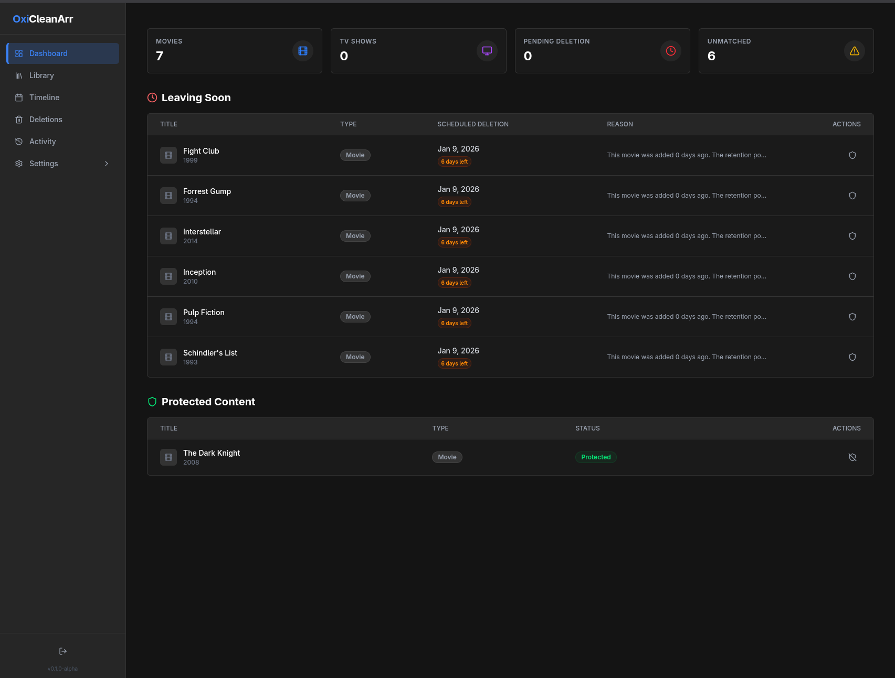
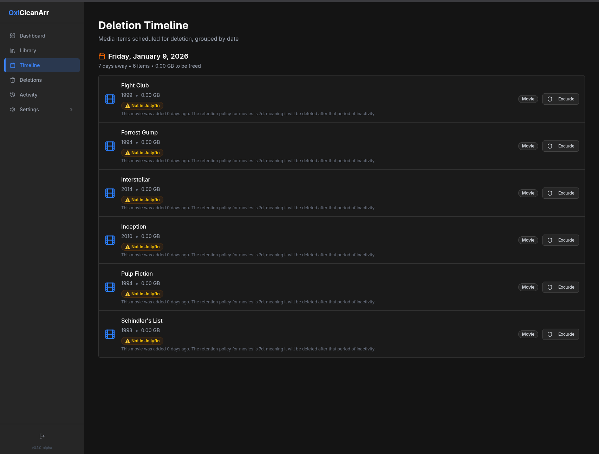
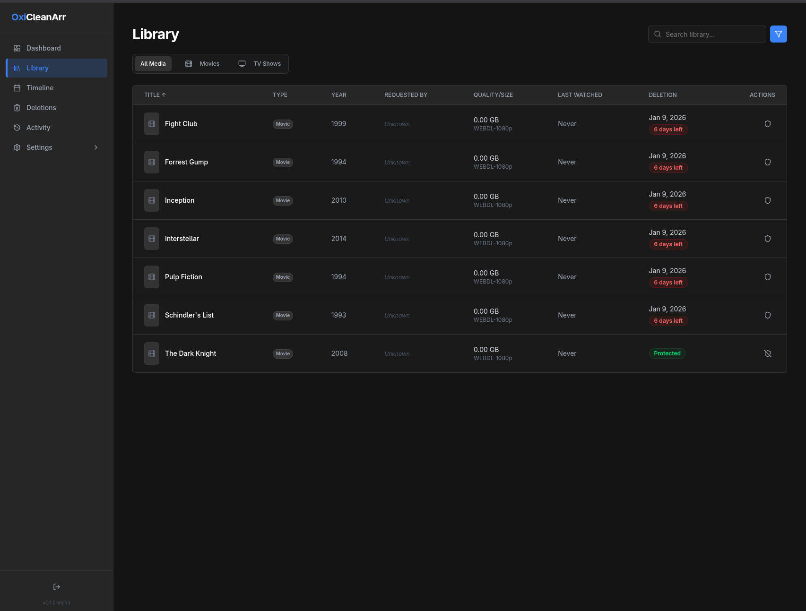
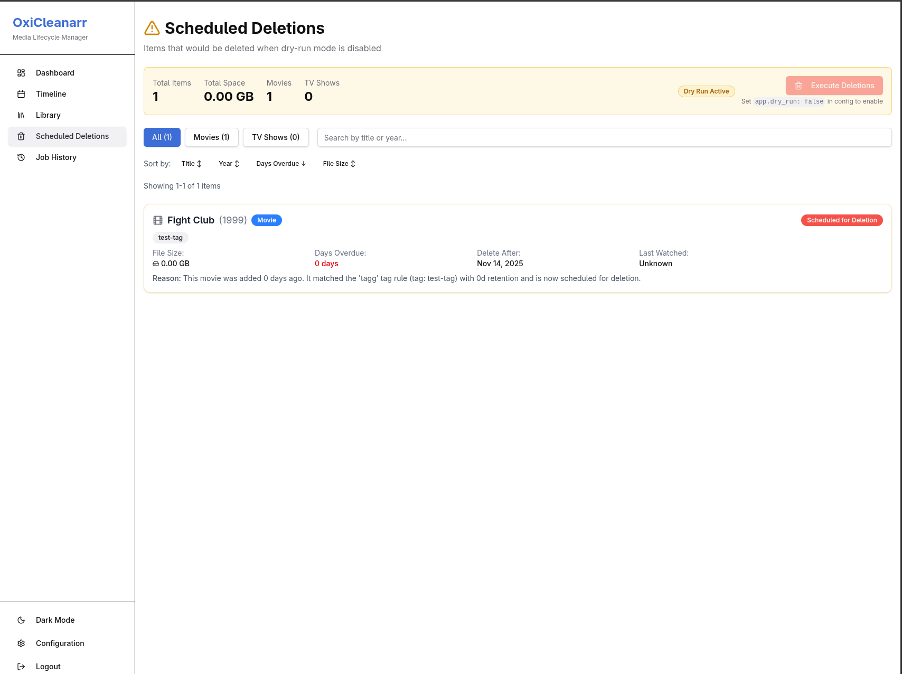
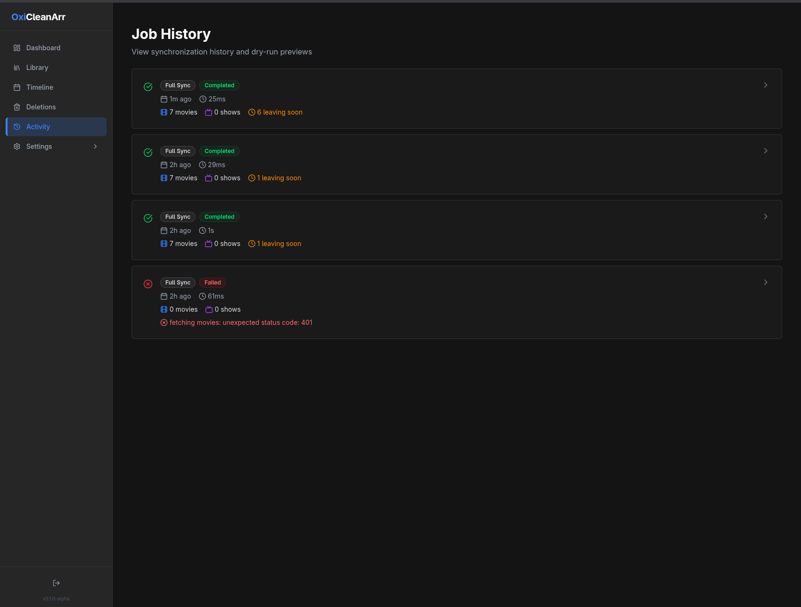
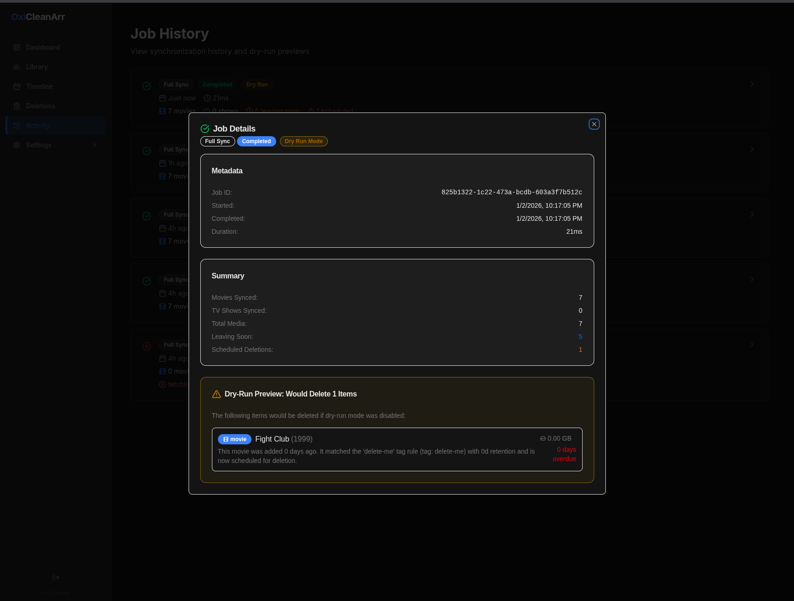
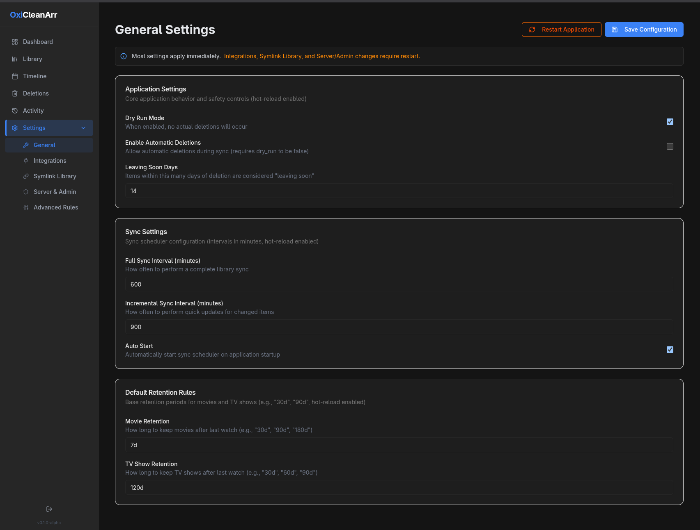
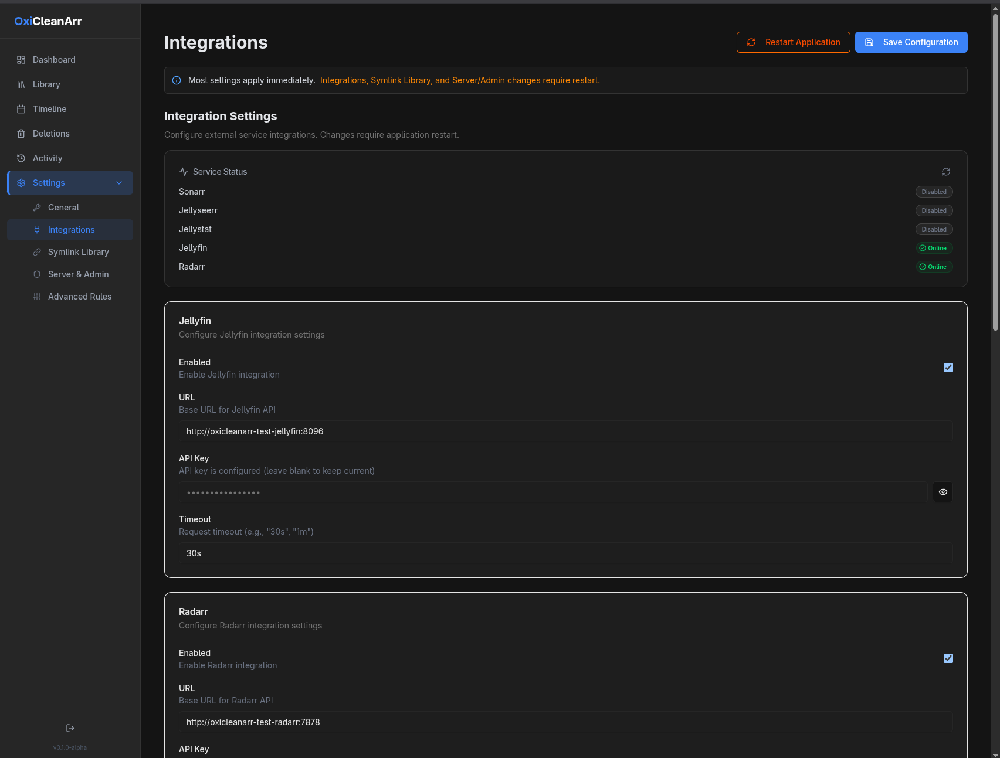
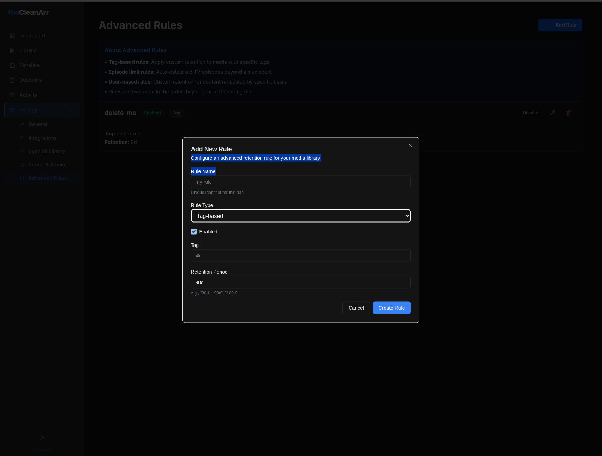
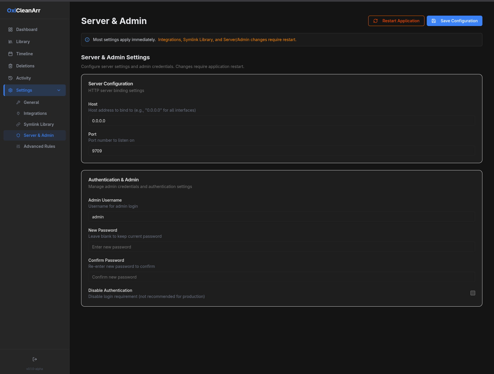

# OxiCleanarr

<p align="center">
  
</p>

> **"But wait, there's more!"** - A lightweight media cleanup automation tool for the *arr stack with Jellyfin integration.

**OxiCleanarr** removes media clutter from your Jellyfin server with the power and effectiveness you'd expect from a product endorsed by Billy Mays himself! Just like OxiClean tackles tough stains, OxiCleanarr tackles your unwatched media backlog.


## Features

- **Automated Media Cleanup**: Intelligently removes unwatched media based on configurable retention rules
- **Advanced Rules Engine**: Tag-based, user-based, and watched-based cleanup rules for fine-grained control
- **"Leaving Soon" Library**: Exposes scheduled-deletion media to the [jellyfin-plugin-leaving-soon](https://github.com/ramonskie/jellyfin-plugin-leaving-soon) plugin, which manages the "leaving soon" symlink libraries in Jellyfin
- **Multi-Service Integration**: Supports Jellyfin, Radarr, Sonarr, Jellyseerr, Jellystat, and Streamystats
- **Safe Operations**: Dry-run mode enabled by default, manual exclusions, and job history tracking
- **Hot Configuration Reload**: Update settings without restarting the application
- **RESTful API**: Complete HTTP API with JWT authentication
- **Structured Logging**: JSON-formatted logs for easy parsing and monitoring

## Screenshots

<details>
<summary>Click to view screenshots</summary>

### Dashboard

*Overview of your media cleanup status with key metrics and recent activity*

### Timeline View

*Visual timeline showing when media items are scheduled for deletion*

### Library Management

*Browse and manage your entire media library with filtering and sorting*

### Scheduled Deletions

*Review items scheduled for deletion and manage exclusions*

### Job History

*Track all sync operations and cleanup jobs with detailed history*

### Job Details

*Detailed view of job execution with statistics and timing information*

### Settings - General

*Configure general application settings and sync intervals*

### Settings - Integrations

*Connect and configure external services (Jellyfin, Radarr, Sonarr, etc.)*

### Settings - Advanced Rules

*Create tag-based, user-based, and watched-based cleanup rules*

### Settings - Server Admin

*Administrative controls including application restart and maintenance*

</details>

## Quick Start

### Prerequisites

- Docker (recommended) or Go 1.21+ (for building from source)
- Active *arr stack services (Radarr and/or Sonarr)
- Jellyfin instance
- **[jellyfin-plugin-leaving-soon](https://github.com/ramonskie/jellyfin-plugin-leaving-soon)** installed in Jellyfin (optional, for the "Leaving Soon" library feature)

> **ℹ️ NOTE:** The "Leaving Soon" symlink libraries are managed by the standalone
> [jellyfin-plugin-leaving-soon](https://github.com/ramonskie/jellyfin-plugin-leaving-soon)
> plugin inside Jellyfin. It polls this server's `GET /api/media/leaving-soon` endpoint,
> resolves each item's path from Jellyfin, and creates/removes the symlink libraries
> itself. OxiCleanarr does not need any file system access for this feature.
>
> **⚠️ Auth:** the plugin polls without a user login. Set `admin.api_key` to a static
> key and configure it in the plugin so its requests are authorized (the key is accepted
> on every protected endpoint, not just leaving-soon). Alternatively run with
> `admin.disable_auth: true` (disables login for the whole app).

### Installation

#### Option A: Docker (Recommended)

**Pull the latest image:**

```bash
docker pull ghcr.io/ramonskie/oxicleanarr:latest
```

**Run with Docker:**

```bash
docker run -d \
  --name oxicleanarr \
  --restart unless-stopped \
  -p 8080:8080 \
  -v /path/to/config:/app/config \
  -v /path/to/data:/app/data \
  -v /path/to/media:/data/media:ro \
  -e PUID=1000 \
  -e PGID=1000 \
  -e TZ=UTC \
  ghcr.io/ramonskie/oxicleanarr:latest
```

**Or use Docker Compose** (see [NAS_DEPLOYMENT.md](NAS_DEPLOYMENT.md) for detailed examples)

**Available Tags:**
- `ghcr.io/ramonskie/oxicleanarr:latest` - Latest stable release
- `ghcr.io/ramonskie/oxicleanarr:v1.0.0` - Specific version
- `ghcr.io/ramonskie/oxicleanarr:1.0` - Major.minor version
- `ghcr.io/ramonskie/oxicleanarr:1` - Major version

#### Option B: Build from Source

#### Step 1: Install the Leaving Soon Plugin (optional)

1. Open Jellyfin → **Dashboard** → **Plugins** → **Repositories**
2. Click **"+"** to add a repository
3. Enter:
   - **Repository Name**: `Leaving Soon Plugin Repository`
   - **Repository URL**: `https://cdn.jsdelivr.net/gh/ramonskie/jellyfin-plugin-leaving-soon@main/manifest.json`
4. Click **Save**
5. Go to **Dashboard** → **Plugins** → **Catalog**
6. Find "Leaving Soon" and click **Install**
7. Restart Jellyfin when prompted
8. Configure the plugin (Settings → Leaving Soon): point an `oxicleanarr` provider at
   `http://<oxicleanarr-host>:8080` and set the base path + library names you want

> **Manual Installation**: For manual installation from source or releases, see the [plugin repository](https://github.com/ramonskie/jellyfin-plugin-leaving-soon)

#### Step 2: Build OxiCleanarr

1. Clone the repository:
```bash
git clone https://github.com/ramonskie/oxicleanarr.git
cd oxicleanarr
```

2. Build the application:
```bash
go build -o oxicleanarr cmd/oxicleanarr/main.go
```

3. Create configuration file:
```bash
mkdir -p config
cp config/config.yaml.example config/config.yaml
```

4. (Optional) Configure the Leaving Soon plugin in Jellyfin — the plugin creates and
   manages the "leaving soon" symlink library directories itself. No paths need to be
   configured in OxiCleanarr.

5. Edit `config/config.yaml` with your service URLs and API keys:
```yaml
admin:
  username: admin
  password: changeme          # ⚠️ Change this! Bcrypt hashes are supported
  disable_auth: false         # Set true to skip login (NOT recommended for production)
  api_key: ""                 # Optional static Bearer key for machine clients (e.g. Leaving Soon plugin)

integrations:
  jellyfin:
    enabled: true
    url: http://jellyfin:8096
    api_key: your-jellyfin-api-key-here
  
  radarr:
    enabled: true
    url: http://radarr:7878
    api_key: your-radarr-api-key-here
  
  sonarr:
    enabled: true
    url: http://sonarr:8989
    api_key: your-sonarr-api-key-here

rules:
  movie_retention: 90d      # Keep movies for 90 days
  tv_retention: 120d        # Keep TV shows for 120 days

app:
  dry_run: true             # Start in safe mode - no actual deletions
  leaving_soon_days: 14     # Show items in "leaving soon" 14 days before deletion
```

**⚠️ Security Note:** Set a strong admin password and protect the file (`chmod 600 config/config.yaml`). With authentication enabled (`disable_auth: false`), you must provide a `JWT_SECRET` environment variable (see below); the app will refuse to start otherwise.

6. Run OxiCleanarr:
```bash
./oxicleanarr
```

The application will start on `http://0.0.0.0:8080` by default.

## Configuration

### Configuration File

OxiCleanarr uses a YAML configuration file located at `./config/config.yaml`. The file supports hot-reloading - changes are automatically applied without restarting the application.

#### Minimal Configuration

```yaml
admin:
  username: admin
  password: changeme
  disable_auth: false        # Set true to disable login (NOT recommended for production)

integrations:
  jellyfin:
    enabled: true
    url: http://jellyfin:8096
    api_key: your-api-key-here
  
  radarr:
    enabled: true
    url: http://radarr:7878
    api_key: your-api-key-here
  
  sonarr:
    enabled: true
    url: http://sonarr:8989
    api_key: your-api-key-here
```

#### Full Configuration

```yaml
admin:
  username: admin
  password: changeme
  disable_auth: false        # Set true to disable login (NOT recommended for production)

app:
  dry_run: true              # Safe mode - no actual deletions
  leaving_soon_days: 14      # Days before retention expires

sync:
  full_interval: 3600        # Full sync every hour (seconds)
  incremental_interval: 900  # Incremental sync every 15 min
  auto_start: true           # Start syncing on startup

rules:
  movie_retention: 90d       # Keep movies for 90 days
  tv_retention: 120d         # Keep TV shows for 120 days

server:
  host: 0.0.0.0
  port: 8080
  read_timeout: 30s
  write_timeout: 30s
  idle_timeout: 60s
  shutdown_timeout: 30s

integrations:
  jellyfin:
    enabled: true
    url: http://jellyfin:8096
    api_key: your-api-key-here
    timeout: 30s
  
  radarr:
    enabled: true
    url: http://radarr:7878
    api_key: your-api-key-here
    timeout: 30s
  
  sonarr:
    enabled: true
    url: http://sonarr:8989
    api_key: your-api-key-here
    timeout: 30s
  
  jellyseerr:
    enabled: false
    url: http://jellyseerr:5055
    api_key: ""
  
  jellystat:
    enabled: false
    url: http://jellystat:3000
    api_key: ""
  
  # Streamystats is mutually exclusive with Jellystat — enable only one.
  streamystats:
    enabled: false
    url: http://streamystats:3000
    api_key: ""        # Your Jellyfin API key (Streamystats validates it against Jellyfin)
    server_id: ""      # Streamystats server UUID (find it in Streamystats → Servers)
```

### Environment Variables

Configuration can be overridden using environment variables with the `OXICLEANARR_` prefix:

```bash
export OXICLEANARR_ADMIN_USERNAME=myadmin
export OXICLEANARR_ADMIN_PASSWORD=mypassword
export OXICLEANARR_SERVER_PORT=9090
export OXICLEANARR_APP_DRY_RUN=false
export OXICLEANARR_INTEGRATIONS_JELLYFIN_URL=http://jellyfin:8096
export OXICLEANARR_INTEGRATIONS_JELLYFIN_API_KEY=your-key
```

JWT authentication variables (required when `admin.disable_auth: false`):

```bash
# REQUIRED for auth-enabled setups: signs login tokens (use at least 32 random chars)
export JWT_SECRET="$(openssl rand -base64 48)"
# Optional: token lifetime (default: 24h)
export JWT_EXPIRATION=24h
```

> **Note:** When `admin.disable_auth: true` (default in dev), the app generates a random JWT secret at startup and authentication is skipped — the web UI opens straight to the dashboard without a login page.

## Advanced Rules

OxiCleanarr provides a powerful rules engine that allows fine-grained control over media cleanup behavior. Rules are evaluated in priority order: **tag-based** → **user-based** → **watched-based** → **default retention**.

### Tag-Based Rules

Target media by Radarr/Sonarr tags for custom retention periods:

```yaml
advanced_rules:
  - name: Kids Content
    type: tag
    enabled: true
    tag: kids
    retention: 60d      # Keep kids content for 60 days
  
  - name: Premium Content
    type: tag
    enabled: true
    tag: premium
    retention: 180d     # Keep premium content for 6 months
```

### User-Based Rules

Apply different retention policies based on who requested the content. Match users by any of: `user_id`, `username`, or `email`.

```yaml
advanced_rules:
  - name: Trial Users
    type: user
    enabled: true
    users:
      - user_id: 42                    # Match by Jellyseerr user ID
        retention: 30d
      - email: guest@example.com       # Match by email address
        retention: 7d
        require_watched: true          # Only delete after watched
      - username: trial_user           # Match by username
        retention: 14d
```

**Integration Requirements**: User-based rules require Jellyseerr integration enabled to match requesters.

### Watched-Based Rules

Automatically clean up content based on watch history. Requires Jellystat or Streamystats integration (mutually exclusive — enable only one).

```yaml
advanced_rules:
  - name: Auto Clean Watched Content
    type: watched
    enabled: true
    retention: 30d              # Delete 30 days after last watch
    require_watched: true       # Only delete media that has been watched
                                # Protects unwatched content from deletion
```

**How it works**: When `require_watched: true`, media must have at least one watch event. The retention period starts from the **last watch date**. Unwatched content is never deleted by this rule.

**Integration Requirements**: Watched-based rules require either **Jellystat** or **Streamystats** enabled to track watch history — but not both at the same time (they are mutually exclusive).

### Rule Priority Order

Rules are evaluated in this order:

1. **Tag-based rules** (highest priority) - If media has a matching tag
2. **User-based rules** - If media was requested by a matching user
3. **Watched-based rules** - If media meets watch criteria
4. **Default retention** (lowest priority) - `movie_retention` or `tv_retention`

The first matching rule determines the retention policy.

### Example: Complete Configuration

```yaml
rules:
  movie_retention: 90d      # Default for movies
  tv_retention: 120d        # Default for TV shows

advanced_rules:
  # Highest priority: Preserve important content by tag
  - name: Keep Forever
    type: tag
    enabled: true
    tag: keep
    retention: never        # Never delete
  
  # Medium priority: Guest users get shorter retention
  - name: Guest Users
    type: user
    enabled: true
    users:
      - username: guest
        retention: 7d
        require_watched: true
  
  # Lower priority: Auto-cleanup watched content
  - name: Watched Cleanup
    type: watched
    enabled: true
    retention: 30d
    require_watched: true
  
  # Fallback: Default retention applies if no rules match
```

## API Documentation

### Authentication

All API endpoints (except `/health`, `/api/auth/login`, `/api/auth/me`, and `/api/auth/logout`)
require authentication. Authentication accepts either a JWT (cookie or
`Authorization: Bearer <jwt>`) or the static `admin.api_key` sent as a Bearer token — so
machine clients like jellyfin-plugin-leaving-soon can call the API without a login.

#### Login

**POST** `/api/auth/login`

Request:
```json
{
  "username": "admin",
  "password": "changeme"
}
```

Response:
```json
{
  "token": "eyJhbGciOiJIUzI1NiIsInR5cCI6IkpXVCJ9...",
  "username": "admin"
}
```

On success the server also sets an **`oxicleanarr_token` httpOnly cookie** (Path=`/`, SameSite=Lax). Browsers send it automatically, so the web UI never reads or stores the token in JavaScript/localStorage.

Authenticate subsequent requests with either the cookie or the `Authorization` header:
```bash
curl -H "Authorization: Bearer YOUR_TOKEN" http://localhost:8080/api/endpoint
```

#### Current User

**GET** `/api/auth/me` — returns the authenticated username:
```json
{
  "username": "admin"
}
```
When `admin.disable_auth: true`, this returns 200 with the configured username.

#### Logout

**POST** `/api/auth/logout` — clears the auth cookie.

### Health Check

**GET** `/health`

Response:
```json
{
  "status": "ok",
  "uptime": "5.803388477s",
  "version": "1.0.0-dev"
}
```

### Media Endpoints

#### List Movies

**GET** `/api/media/movies`

Query parameters:
- `sort_by`: Sort field (`title`, `added_at`, `delete_after`)
- `order`: Sort order (`asc`, `desc`)
- `status`: Filter by status (`all`, `leaving_soon`, `excluded`)

Response:
```json
{
  "movies": [
    {
      "id": "radarr-123",
      "type": "movie",
      "title": "Example Movie",
      "year": 2023,
      "added_at": "2024-01-01T00:00:00Z",
      "last_watched": "2024-01-15T00:00:00Z",
      "watch_count": 2,
      "file_size": 4294967296,
      "quality_tag": "Bluray-1080p",
      "is_excluded": false,
      "is_requested": false,
      "delete_after": "2024-04-01T00:00:00Z",
      "days_until_due": 30
    }
  ],
  "total": 1
}
```

#### List TV Shows

**GET** `/api/media/shows`

Query parameters: Same as movies

Response: Similar to movies but with `type: "tv_show"`

#### List Media Leaving Soon

**GET** `/api/media/leaving-soon`

Returns media items scheduled for deletion within the `leaving_soon_days` threshold, in
the normalized contract consumed by jellyfin-plugin-leaving-soon (and any other provider
consumer). Items without a Jellyfin match and excluded items are omitted.

Response:
```json
{
  "version": 1,
  "items": [
    {
      "mediaServerId": "jellyfin-item-guid",
      "type": "movie",
      "title": "The Matrix",
      "deletionDate": "2026-09-01T00:00:00Z",
      "sourcePath": "/data/media/movies/The Matrix (1999)/The Matrix (1999).mkv"
    }
  ]
}
```

- `mediaServerId` — the Jellyfin item GUID (required; the plugin resolves the path from Jellyfin itself)
- `type` — `movie` or `show`
- `title`, `deletionDate`, `sourcePath` — optional, informational

> **Note:** The web UI consumes the same leaving-soon feed through
> `GET /api/media/leaving-soon/list`, which returns the rich `{items: [...], total: N}`
> shape (poster ids, watch data, deletion reasons). This endpoint is separate from the
> machine-readable contract above.

#### Get Media Item

**GET** `/api/media/{id}`

Returns details for a specific media item.

#### Add Exclusion

**POST** `/api/media/{id}/exclude`

Excludes a media item from automated deletion.

Request:
```json
{
  "reason": "Personal favorite"
}
```

Response:
```json
{
  "success": true,
  "message": "Exclusion added"
}
```

#### Remove Exclusion

**DELETE** `/api/media/{id}/exclude`

Removes an exclusion, allowing the item to be deleted again.

Response:
```json
{
  "success": true,
  "message": "Exclusion removed"
}
```

#### Delete Media

**DELETE** `/api/media/{id}`

Deletes a media item from all services (Radarr/Sonarr, Jellyfin).

Query parameters:
- `dry_run=true`: Preview deletion without actually deleting

Response:
```json
{
  "success": true,
  "message": "Media deleted successfully",
  "dry_run": false
}
```

### Sync Endpoints

#### Trigger Full Sync

**POST** `/api/sync/full`

Triggers a complete synchronization of all media from all services.

Response:
```json
{
  "success": true,
  "message": "Full sync started"
}
```

#### Trigger Incremental Sync

**POST** `/api/sync/incremental`

Triggers a quick sync of watch history data only.

Response:
```json
{
  "success": true,
  "message": "Incremental sync started"
}
```

#### Get Sync Status

**GET** `/api/sync/status`

Returns the current sync engine status.

Response:
```json
{
  "running": true,
  "media_count": 1523,
  "last_full_sync": "2024-11-02T10:30:00Z",
  "last_incr_sync": "2024-11-02T11:45:00Z",
  "full_interval_seconds": 3600,
  "incr_interval_seconds": 900,
  "movies_count": 842,
  "tv_shows_count": 681,
  "excluded_count": 15
}
```

### Jobs Endpoints

#### List Jobs

**GET** `/api/jobs`

Returns all job execution history.

Response:
```json
{
  "jobs": [
    {
      "id": "uuid",
      "type": "full_sync",
      "status": "completed",
      "started_at": "2024-11-02T10:30:00Z",
      "completed_at": "2024-11-02T10:35:23Z",
      "duration_ms": 323000,
      "summary": {
        "movies": 842,
        "tv_shows": 681,
        "total_media": 1523
      }
    }
  ],
  "total": 1
}
```

#### Get Job

**GET** `/api/jobs/{id}`

Returns details for a specific job.

#### Get Latest Job

**GET** `/api/jobs/latest`

Returns the most recent job execution.

## File Structure

```
oxicleanarr/
├── cmd/
│   └── oxicleanarr/
│       └── main.go           # Application entry point
├── internal/
│   ├── api/
│   │   ├── handlers/         # HTTP request handlers
│   │   ├── middleware/       # Authentication, logging, recovery
│   │   └── router.go         # Route definitions
│   ├── cache/                # In-memory caching
│   ├── config/               # Configuration management
│   ├── services/             # Business logic
│   ├── storage/              # File-based persistence
│   └── utils/                # Utilities (logging, JWT)
├── config/
│   └── config.yaml      # Configuration file
├── data/
│   ├── exclusions.json       # Media exclusions
│   └── jobs.json             # Job history
└── README.md
```

## Development

### Building

```bash
go build -o oxicleanarr cmd/oxicleanarr/main.go
```

### Running in Development

```bash
go run cmd/oxicleanarr/main.go
```

### Testing

```bash
# Test health endpoint
curl http://localhost:8080/health

# Test login
curl -X POST http://localhost:8080/api/auth/login \
  -H "Content-Type: application/json" \
  -d '{"username":"admin","password":"changeme"}'

# Test with authentication
TOKEN=$(curl -s -X POST http://localhost:8080/api/auth/login \
  -H "Content-Type: application/json" \
  -d '{"username":"admin","password":"changeme"}' | jq -r .token)

curl -H "Authorization: Bearer $TOKEN" http://localhost:8080/api/endpoint
```

## Roadmap

- [x] **Phase 1: Foundation** - Configuration, authentication, API framework
- [x] **Phase 2: Media Operations** - Syncing, analysis, cleanup automation
- [ ] **Phase 3: Management UI** - Web interface for monitoring and control

## Security

- JWT tokens for API authentication, delivered as httpOnly cookies (token never touches JavaScript/localStorage)
- Configurable token expiration via `JWT_EXPIRATION` (default: 24 hours)
- JWT signing requires the `JWT_SECRET` environment variable (min 32 chars) when authentication is enabled
- Admin passwords support bcrypt hashes; plain-text values are accepted for backwards compatibility
- CORS support for web UI integration — cross-origin origins must be listed in `server.cors_origins`
- **⚠️ Important:** protect `config/config.yaml` with restricted permissions (`chmod 600`)

## License

MIT License

## Contributing

Contributions are welcome! Please feel free to submit a Pull Request.
